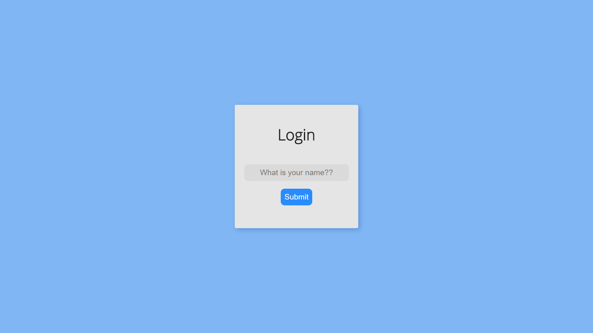
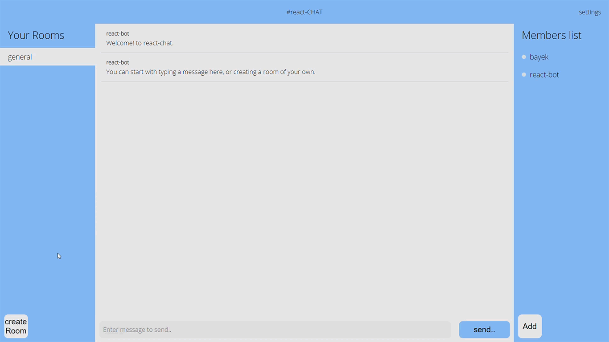
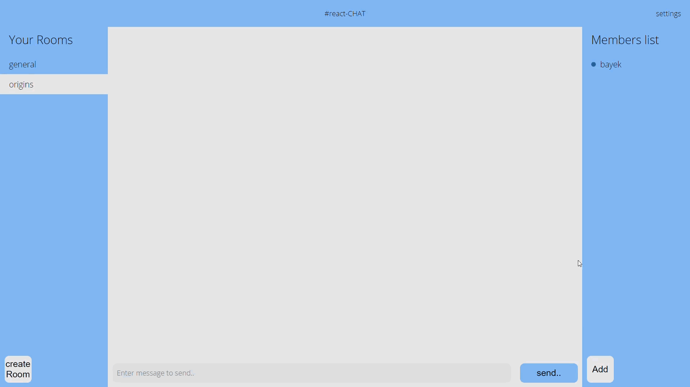
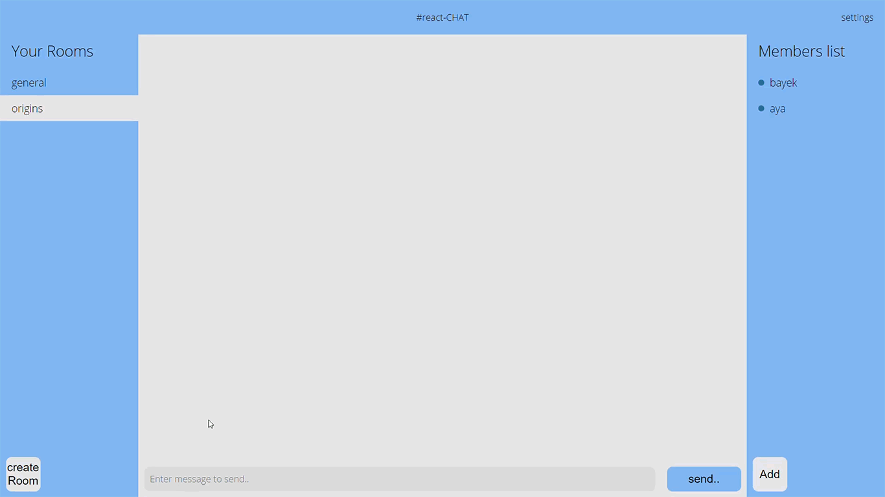
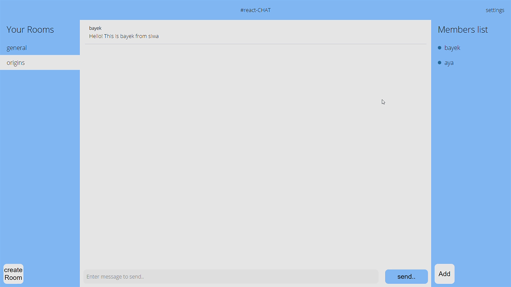

# React Chat

Web app for live room chat.

check live demo at **https://sumitjoshi97.github.io/react-slack**

### Local Installation

1. Fork and clone this repo
2. run yarn
3. Add chatkit instance locator to env file
4. run yarn start

> Note: You will require these to run locally -
>
> 1. react-chat-server to run locally https://github.com/react-slack-server
> 2. a pusher chatkit account
> 3. create a room with name general in pusher chatkit

### Todo

- [x] Signup / Login User
- [x] User can create room
- [x] Room chats
- [x] User can enter messages in room
- [x] User can add members to a room
- [x] Add different themes in app
- [x] Show presence of user - whether online or offline
- [x] Show current active room
- [ ] User roles - admin, member
- [ ] Typing indicator to show users who are currently typing
- [ ] Show bottom messages in focus
- [ ] Functionality to remove room
- [ ] Functionality to remove member
- [ ] Private rooms
- [ ] One to one chats

### Screenshots

_login page_

 

_add new room_

 

_add new member to a room_

 

_send message_

 

_change theme - blue, red, dark_
